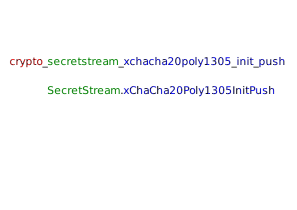

> [!CAUTION]
> Experimental library!

# Libsodium bindings for Kotlin Multiplatform

Libsodium bindings project uses libsodium c sources and libsodium.js to provide a kotlin multiplatform wrapper library for libsodium. The library is feature complete and usable.

## Warning
While this library is just a wrapper around the well known Libsodium library it still comes with high potential of introducing new
attack surfaces, bugs and other issues and you shouldn't use it in production until it has been reviewed by community. 

## Installation

#### Gradle
```kotlin
implementation("com.ionspin.kotlin:multiplatform-crypto-libsodium-bindings:0.9.3")
```

#### Snapshot builds
```kotlin
repositories {
    maven("https://oss.sonatype.org/content/repositories/snapshots")
}
implementation("com.ionspin.kotlin:multiplatform-crypto-libsodium-bindings:0.9.4-SNAPSHOT")

```


## Usage

Before using the wrapper you need to initialize the underlying libsodium library. You can use either a callback or coroutines approach

```
    LibsodiumInitializer.initializeWithCallback {
        // Libsodium initialized
    }
```

```
    suspend fun initalizeProject() {
        ...
        LibsodiumInitializer.intialize()
        ...
    }
```

After intiailization you can call libsodium functions directly

The API is very close to libsodium but still adapted to kotlin standards, as an example here is the usage of authenticated
encryption api:

**libsodium:**

```
    #define MESSAGE ((const unsigned char *) "test")
    #define MESSAGE_LEN 4
    #define CIPHERTEXT_LEN (crypto_secretbox_MACBYTES + MESSAGE_LEN)
    
    unsigned char key[crypto_secretbox_KEYBYTES];
    unsigned char nonce[crypto_secretbox_NONCEBYTES];
    unsigned char ciphertext[CIPHERTEXT_LEN];
    
    crypto_secretbox_keygen(key);
    randombytes_buf(nonce, sizeof nonce);
    crypto_secretbox_easy(ciphertext, MESSAGE, MESSAGE_LEN, nonce, key);
    
    unsigned char decrypted[MESSAGE_LEN];
    if (crypto_secretbox_open_easy(decrypted, ciphertext, CIPHERTEXT_LEN, nonce, key) != 0) {
        /* message forged! */
    }
```

**kotlin:**
```
    val message = ("Ladies and Gentlemen of the class of '99: If I could offer you " +
                   "only one tip for the future, sunscreen would be it.").encodeToUByteArray()

    val key = LibsodiumRandom.buf(32)

    val nonce = LibsodiumRandom.buf(24)

    val encrypted = SecretBox.easy(message, nonce, key)
    val decrypted = SecretBox.openEasy(encrypted, nonce, key)
``` 
If message cannot be verified, `openEasy` function will throw a `SecretBoxCorruptedOrTamperedDataExceptionOrInvalidKey`

In some cases libsodium C api returns two values, usually encrypted data and a autogenerated nonce. In situations like
those, kotlin API returns a data class wrapping both objects. An example of this behavior is initializing the secret stream, where initialization funciton returns both the header and state:

**libsodium:**
```
    crypto_secretstream_xchacha20poly1305_state state;
    unsigned char key[crypto_secretstream_xchacha20poly1305_KEYBYTES];
    unsigned char header[crypto_secretstream_xchacha20poly1305_HEADERBYTES];
    
    /* Set up a new stream: initialize the state and create the header */
    crypto_secretstream_xchacha20poly1305_init_push(&state, header, key);
```


**kotlin:**
This is what the response data class definition looks like:
```
    data class SecretStreamStateAndHeader(val state: SecretStreamState, val header : UByteArray)
```
And here is the usage sample
```
    val key = LibsodiumRandom.buf(crypto_secretstream_xchacha20poly1305_KEYBYTES)
    val stateAndHeader = SecretStream.xChaCha20Poly1305InitPush(key)
    val state = stateAndHeader.state
    val header = stateAndHeader.header 
```

If a libsodium call fails, `xChaCha20Poly1305InitPush` function will throw a `GeneralLibsodiumException`.

The functions are mapped from libsodium to kotiln objects, so `crypto_secretstream_xchacha20poly1305_init_push` becomes
`SecretStream.xChaCha20Poly1305InitPush`


At the moment you should refer to original libsodium documentation for instructions on how to use the library

## Supported native platforms

Currently supported native platforms (Apple Silicon is supported since 0.8.5) :

|Platform| Supported          |
|--------|--------------------|
|Linux X86 64| :heavy_check_mark: |
|Linux Arm 64| :heavy_check_mark: |
|macOS X86 64| :heavy_check_mark: |
|macOS Arm 64 (Apple Silicon)| :heavy_check_mark: |
|iOS x86 64 | :heavy_check_mark: |
|iOS Arm 64 | :heavy_check_mark: |
|iOS Simulator Arm 64 (Apple Silicon)| :heavy_check_mark: |
|watchOS Arm 32 | :heavy_check_mark: |
|watchOS Simulator Arm 64 (Apple Silicon)| :heavy_check_mark: |
|tvOS X86 64 | :heavy_check_mark: |
|tvOS Arm 64 | :heavy_check_mark: |
|tvOS Simulator Arm 64 (Apple Silicon)| :heavy_check_mark: |
|minGW X86 64| :heavy_check_mark: |

[List of supported bindings (outdated)](https://github.com/ionspin/kotlin-multiplatform-crypto/blob/master/supported_bindings_list.md)
### Where do the compiled libraries used by JVM and Android come from
Android .so files come from running dist-build scripts in libsodium which you can find in the libsodium submodule
Java Linux Arm/X86_64 and Mac so and dylib are the same as produced by multiplatform builds, also based on the same submodule commit
Java Windows dll is from https://download.libsodium.org/libsodium/releases/libsodium-1.0.19-stable-msvc.zip
Javascript is from libsodium-wrappers-sumo npm package version 0.7.13 (https://github.com/jedisct1/libsodium.js)

### TODO:
- Improve documentation
- Running tests on Android
- Complete exposing libsodium constants
- Build MSVC so it's binaries are completely equal
- Find a better way of fetching Konan dependencies than having a dummy project.

### Building
Clone the git, init the submodule and run `./gradlew build`. Note that current build settings are such that only linux builds `js` target.

#### Notes for Github runners:
- At the moment all runners need to have android sdk present even though not all are building Android build

#### Windows:
- Needs android sdk
- Git needs long file path enabled
- msys2 needs to be installed and `pacman update` executed

# Audits

A personal audit of version 0.9.2 was done by Renee Vandervelde (@ReneeVandervelde), you can find it here https://reneevandervelde.com/publications/expect-fun/audit-ionspin-kmp-libsodium.html

Thanks Renee!


